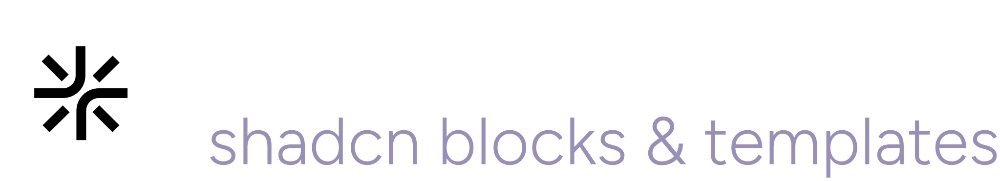

<div align="center">
	<br>
	<br>
    <picture>
      <source media="(prefers-color-scheme: light)" srcset="src/assets/logos/reactbits-gh-black.svg">
      <source media="(prefers-color-scheme: dark)" srcset="src/assets/logos/reactbits-gh-white.svg">
      
    </picture>
	<br>
	<br>
  <strong>The largest & most creative library of animated React components.</strong>
  <br />
  <sub>Stand out with 200+ free, customizable animations for text, backgrounds, UI, and micro interactions.</sub>
	<br>
	<br>
  <a href="https://github.com/davidhdev/react-bits/stargazers"></a>
  <a href="https://github.com/davidhdev/react-bits/blob/main/LICENSE.md"></a>
  <br>
  <br>
  <a href="https://reactbits.dev/">📖 Documentation</a> · <a href="https://reactbits.dev/get-started/installation">⚡ Quick Start</a> · <a href="https://reactbits.dev/tools">🛠️ Tools</a>
</div>

<br />

<div align="center">
  
</div>

<br />

## ✨ Why React Bits?

React Bits helps you **ship stunning interfaces faster**. Instead of spending hours crafting animations from scratch, grab a polished component and customize it to fit your vision.

> 💬 **Text Animations** · 🌀 **Animations** · 🧩 **Components** · ⚡ **Micro** · 🖼️ **Backgrounds**

## 🚀 Features

- **200+ components** — text animations, UI elements, micro interactions, and backgrounds, growing weekly
- **Minimal dependencies** — lightweight and tree-shakeable
- **Fully customizable** — tweak everything via props or edit the source directly
- **4 variants per component** — JS-CSS, JS-TW, TS-CSS, TS-TW (everyone's happy)
- **Copy-paste ready** — works with any modern React project

## 🛠️ Creative Tools

<div align="center">
  
</div>

<hr />

### Beyond components, React Bits offers **free creative tools** to supercharge your workflow:

| Tool                                                 | What it does                                                                             |
| ---------------------------------------------------- | ---------------------------------------------------------------------------------------- |
| **[Background Studio](https://reactbits.dev/tools)** | Explore animated backgrounds, customize effects, export as video/image/code              |
| **[Shape Magic](https://reactbits.dev/tools)**       | Create inner rounded corners between shapes, export as SVG, React code or clip-path code |
| **[Texture Lab](https://reactbits.dev/tools)**       | Apply 20+ effects (noise, dithering, ASCII) to images/videos and export in high quality  |

## 📦 Installation

React Bits supports [shadcn](https://ui.shadcn.com/) and [jsrepo](https://jsrepo.dev) for quick CLI installs.

```bash
# Example: Add a component via shadcn
npx shadcn@latest add @react-bits/BlurText-TS-TW
```

Each component page includes copy-ready CLI commands. See the [installation guide](https://reactbits.dev/get-started/installation) for full details.

You can also select your preferred technologies, and copy the code manually.

## 🚀 Sponsors

React Bits is proudly supported by these amazing sponsors:

### Diamond

<a href="https://www.shadcnblocks.com/?utm_source=reactbits&utm_medium=sponsor&utm_campaign=diamond&ref=reactbits" target="_blank">
  <picture>
    <source media="(prefers-color-scheme: dark)" srcset="public/assets/sponsors/shadcnblocks.svg">
    <source media="(prefers-color-scheme: light)" srcset="public/assets/sponsors/shadcnblocks-lightmode.svg">
    
  </picture>
</a>

### Silver

<a href="https://shadcncraft.com/?utm_source=reactbits&utm_medium=sponsor&utm_campaign=silver&ref=reactbits" target="_blank">
  <picture>
    <source media="(prefers-color-scheme: dark)" srcset="public/assets/sponsors/shadcncraft.svg">
    <source media="(prefers-color-scheme: light)" srcset="public/assets/sponsors/shadcncraft-lightmode.svg">
    
  </picture>
</a>

<a href="https://shadcnuikit.com/?utm_source=reactbits&utm_medium=sponsor&utm_campaign=silver&ref=reactbits" target="_blank">
  <picture>
    <source media="(prefers-color-scheme: dark)" srcset="public/assets/sponsors/shadcnuikit.svg">
    <source media="(prefers-color-scheme: light)" srcset="public/assets/sponsors/shadcnuikit-lightmode.svg">
    
  </picture>
</a>

<a href="https://shadcnstudio.com/?utm_source=reactbits&utm_medium=sponsor&utm_campaign=silver&ref=reactbits" target="_blank">
  <picture>
    <source media="(prefers-color-scheme: dark)" srcset="public/assets/sponsors/shadcnstudio.svg">
    <source media="(prefers-color-scheme: light)" srcset="public/assets/sponsors/shadcnstudio-lightmode.svg">
    
  </picture>
</a>

<hr />

**[Become a sponsor](https://reactbits.dev/sponsors)** — Get your brand in front of 500K+ developers monthly.

## 🤝 Contributing

We'd love your help! Check the [open issues](https://github.com/DavidHDev/react-bits/issues) or submit ideas via the [feature request template](https://github.com/DavidHDev/react-bits/issues/new?template=2-feature-request.yml).

Please read the [contribution guide](https://github.com/DavidHDev/react-bits/blob/main/CONTRIBUTING.md) first — thanks for making React Bits better!

## 🙌 Contributors

<!-- <a href="https://github.com/davidhdev/react-bits/graphs/contributors">
  
</a> -->


## 👤 Maintainer

**[David Haz](https://github.com/DavidHDev)** — creator & lead maintainer

## 🌐 Official Ports

| Framework | Link                                      |
| --------- | ----------------------------------------- |
| Vue.js    | [vue-bits.dev](https://vue-bits.dev/)     |
| Svelte    | [sveltebits.xyz](https://sveltebits.xyz/) |

## 📊 Stats


## 🗳️ Credit

React Bits occasionally draws inspiration from publicly available code examples. These are rewritten as full-fledged, customizable components for JS, TS, CSS, and Tailwind. If you recognize your work, [open an issue](https://github.com/DavidHDev/react-bits/issues) to request credit.

## 📄 License

[MIT + Commons Clause](https://github.com/davidhdev/react-bits/blob/main/LICENSE.md) — free for personal and commercial use.
